<h1 align="center">基于SpringBoot+Vue的毕业就业信息管理系统【带论文】</h1>

- <b>完整代码获取地址：从戎源码网 ([https://armycodes.com/](https://armycodes.com/))</b>
- <b>技术探讨、资料分享，请加QQ群：692619798</b>
- <b>作者微信：19941326836  QQ：3645296857</b>
- <b>承接计算机毕业设计、Java毕业设计、Python毕业设计、深度学习、机器学习</b>
- <b>选题+开题报告+任务书+程序定制+安装调试+论文+答辩ppt 一条龙服务</b>
- <b>所有选题地址 ([https://github.com/Descartes007/allProject](https://github.com/Descartes007/allProject)) </b>

## 一、项目介绍

### 基于SpringBoot+Vue的毕业就业信息管理系统，系统角色为管理员、学生、公司，主要功能如下
### 管理员：
- 基本操作：登录、修改密码、获取个人信息、修改个人信息、退出
- 用户管理：获取用户列表、查看详情、新增用户、修改用户、删除用户、重置密码
- 学生管理：筛选学生、获取学生列表、查看学生详情、新增学生、修改学生、逻辑删除、注册/登录管理、重置密码、获取会话信息
- 公司管理：筛选公司、获取公司列表、查看公司详情、新增公司、修改公司、逻辑删除、注册/登录管理、重置密码、获取会话信息
- 职位招聘管理：筛选职位、获取职位列表、查看职位详情、新增职位、修改职位、删除职位、上下架状态维护
- 简历管理：获取简历列表、查看简历详情、新增简历、修改简历、删除简历
- 简历投递管理：获取投递列表、查看投递详情、新增投递、修改投递、删除投递、防止重复投递
- 就业统计管理：获取统计列表、查看统计详情、新增统计、修改统计、删除统计、审核状态维护
- 职位留言管理：获取留言列表、查看留言详情、发布留言、回复留言、修改留言、删除留言
- 公告信息管理：获取公告列表、查看公告详情、发布公告、修改公告、逻辑删除
- 公司：
- 基本操作：登录、修改密码、获取个人信息、修改个人信息、注册、重置密码、退出
### 公司信息管理：查看/编辑本公司信息
- 职位招聘管理：发布职位、获取职位列表、查看职位详情、修改职位、删除职位、上下架状态维护
- 简历投递管理：查看收到的投递、查看投递详情（含应聘者简历）、更新投递记录
- 职位留言管理：查看职位留言、回复留言、删除留言
- 公告信息：查看公告列表、查看公告详情
### 学生：
- 基本操作：登录、修改密码、获取个人信息、修改个人信息、注册、重置密码、退出
- 简历管理：新建/编辑个人简历（限一份）、查看简历详情、删除简历
- 职位招聘：筛选职位、获取职位列表、查看职位详情
- 简历投递：投递职位、查看个人投递记录、查看投递详情、防重复投递
- 职位留言：对职位留言、查看留言与企业回复
- 就业统计：提交就业统计信息、查看审核状态
- 公告信息：查看公告列表、查看公告详情

## 二、项目技术

- 编程语言：Java
- 项目架构：B/S架构
- 前端技术：Vue 2、ElementUI、Vue Router、Vuex、Axios
- 后端技术：Spring Boot、MyBatis-Plus、Token认证（自定义TokenService）、FastJSON

## 三、运行环境

- JDK版本：1.8及以上都可以
- 操作系统：Windows7/10、MacOS
- 开发工具：IDEA、Ecplise、MyEclipse都可以

## 四、数据库配置文件

- npm版本：6.14.13及以上都可以
- Redis版本：3.2.100及以上都可以
- 文件名：application.yml
- 编码类型：utf8

## 论文截图

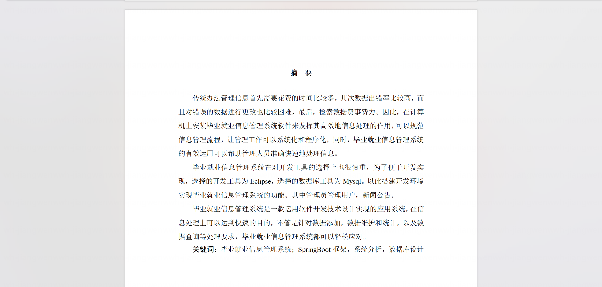

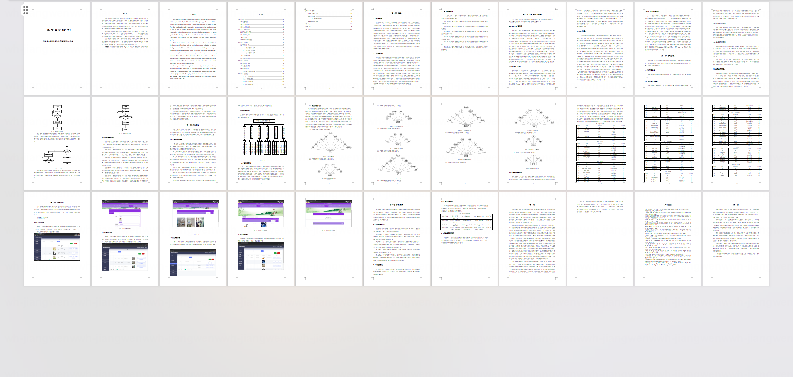

## 系统截图

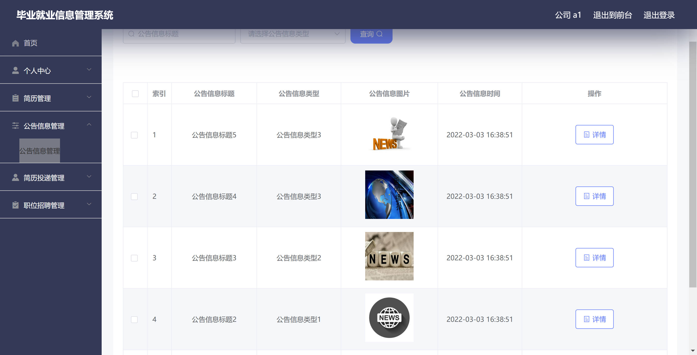

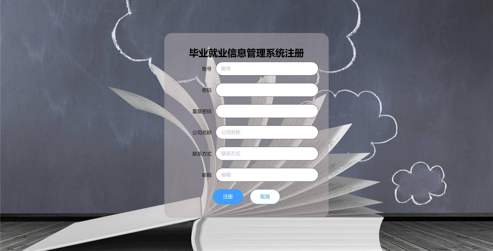

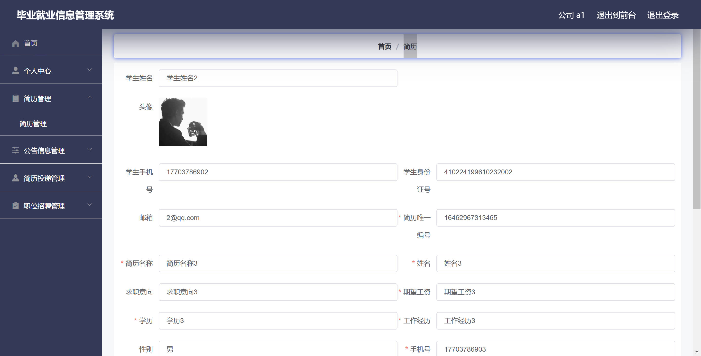

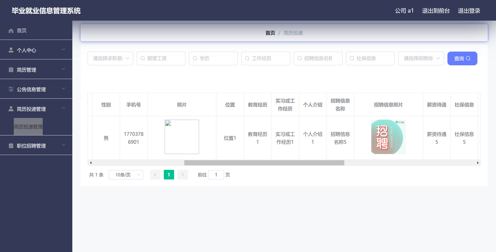

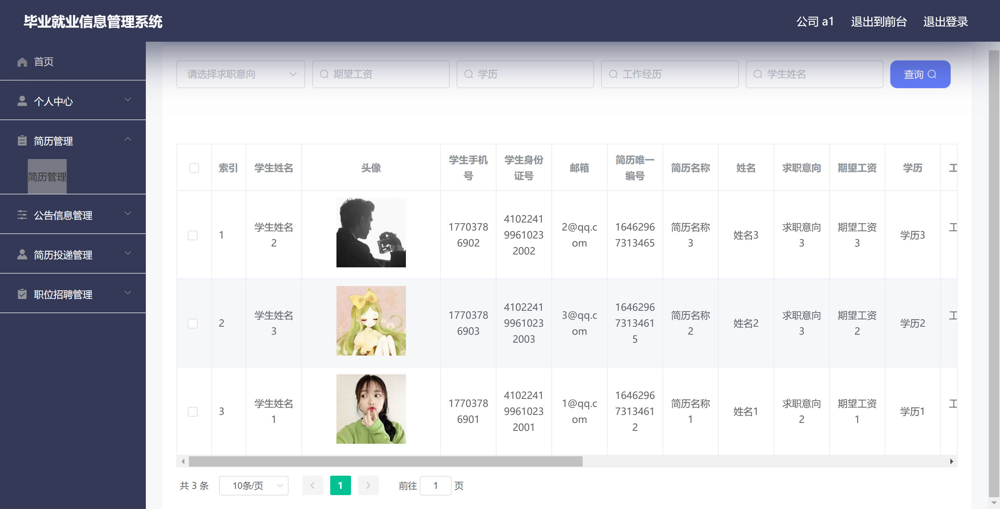

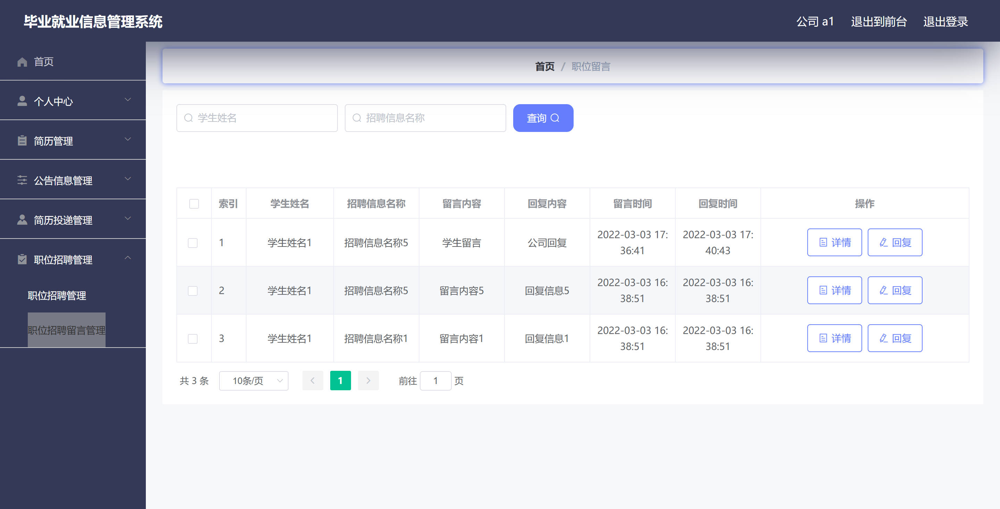

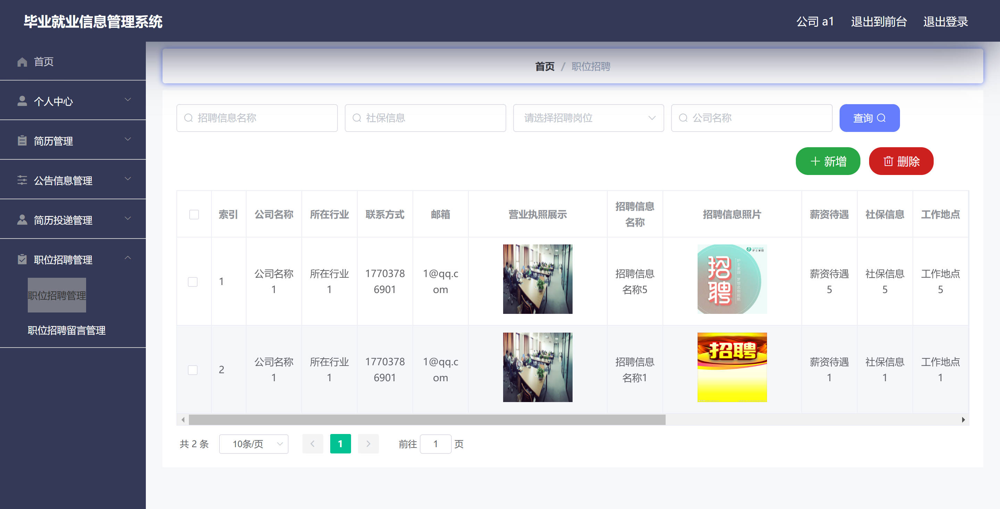

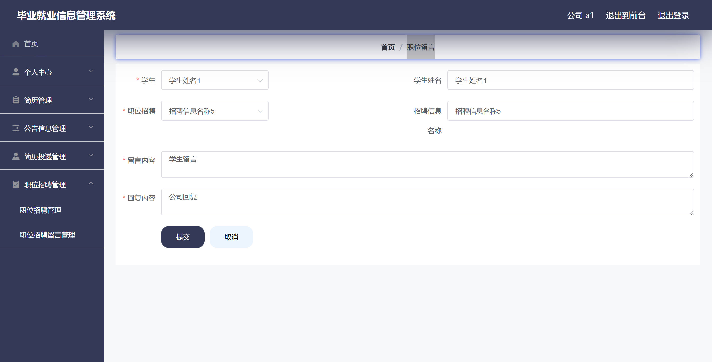

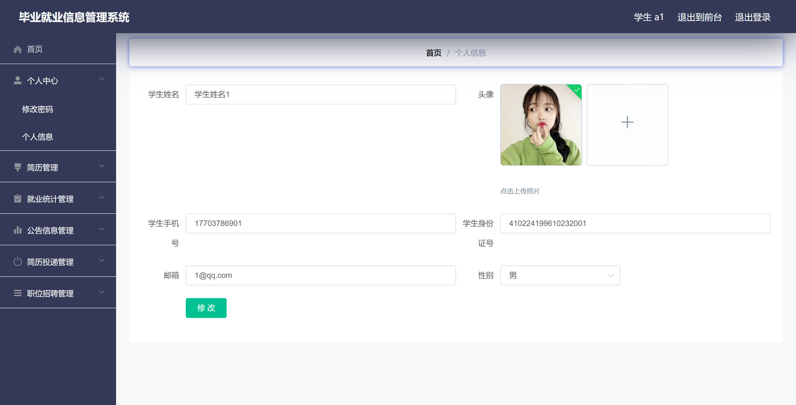

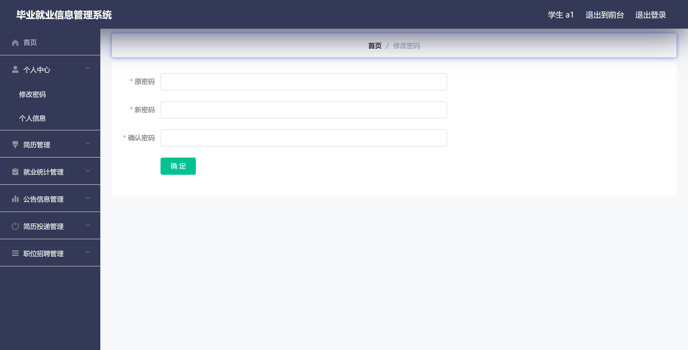
